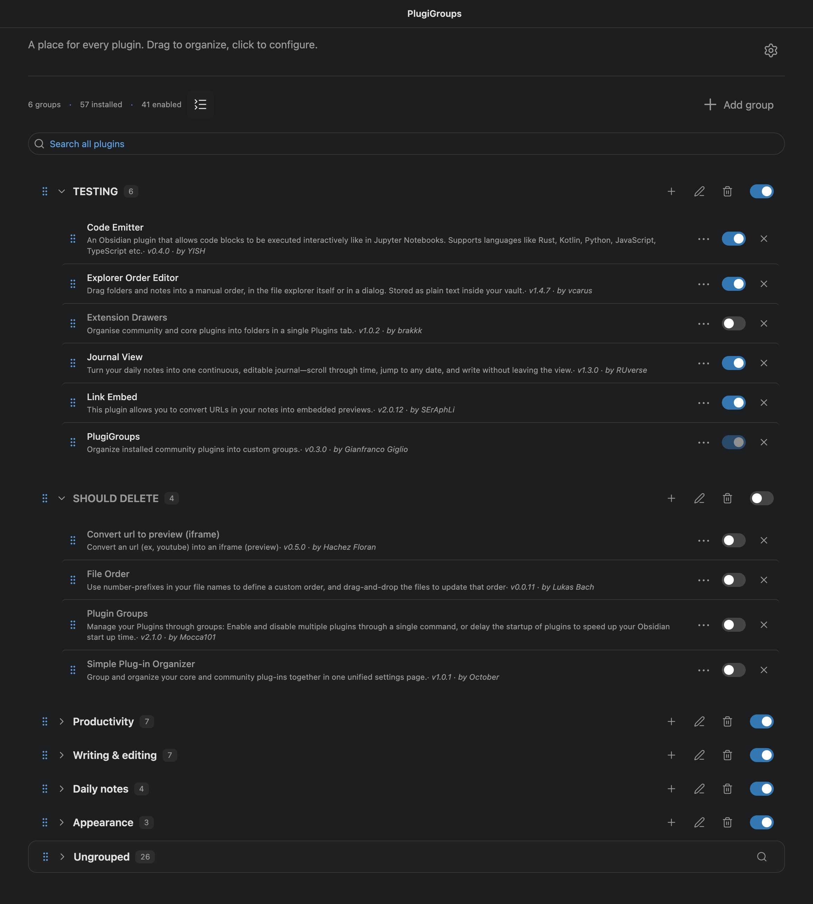

PlugiGroups allows you to order plugins into groups and manage them.



## Using the tab

Open **PlugiGroups** from the ribbon or command palette. Select the **Add group** (+) icon to create a group and immediately edit its name inline. Press **Enter** to save the name, or **Escape** to keep the default name. Drag plugins from **Ungrouped** into a group, use their **Move to** button to choose a group, or use **+ Add plugin** in a group to choose one from a searchable list. You can rename, reorder, collapse, and delete groups.

To hide the ribbon button, turn off **Show ribbon button** in the plugin settings. The command palette entry remains available.

Use **Open PlugiGroups in** in the plugin settings to choose **Tab** (the default) or **New window**. This applies to the ribbon, command palette, and settings button. Opening PlugiGroups focuses an existing view in the chosen location when available.

The new window is dedicated to PlugiGroups, with a window title and no tab bar or view navigation. Other tabs opened in that window move to the main Obsidian window.

The button immediately beside the group/plugin stats cycles through **saved group states** (list with collapse chevrons) → **all collapsed** (inward chevrons) → **all expanded** (outward chevrons) → saved states. Its icon shows the current mode, with text appearing on hover or keyboard focus; its tooltip describes the next action. Global modes preserve individual group states. Clicking a group's chevron changes only that group and saves its new state without switching the general mode. Selecting another general mode reapplies it to every group; the individual mode retains those manual changes. The selected mode and individual states persist across reloads and synchronize across tabs. The button is disabled during a global search, which reveals matching plugins.

**Ungrouped** lists plugins that are not in a group. Use the search bar below the header controls to search by plugin name or ID across all groups and Ungrouped. Results update as you type, including plugins in collapsed groups. Clear the field or press **Escape** to show everything again. Ungrouped also has its own permanent search bar. Its search icon focuses the field. This filters only Ungrouped, together with any global search. Press **Escape** in that field to clear its filter. Deleting a group does not uninstall its plugins; they return to **Ungrouped** unless they belong to another group.

To delete groups without a confirmation dialog, turn off **Confirm before deleting groups** in the plugin settings. Confirmation is enabled by default.

## Plugin controls

- Use a plugin's switch to enable or disable it. A group's switch controls all installed plugins in that group.
- Click a plugin to open its settings. Plugins without a settings page open in **Community plugins**.
- Use a plugin's **⋯** menu for details and other available actions, such as hotkeys or uninstall.

PlugiGroups stays enabled if you switch off a group that contains it.

## Allow multiple groups

By default, a plugin can belong to one group. The **Allow plugins in multiple groups** setting lets it appear in several groups. Group assignments are saved.

**Mobile support:** PlugiGroups does not work on mobile yet.

## Obsidian CLI

PlugiGroups registers twenty commands directly in Obsidian's CLI while the plugin is enabled. Enable Obsidian's CLI under **Settings → General**. See the [Obsidian CLI reference](https://help.obsidian.md/cli) for installation and vault selection.

```sh
obsidian vault=testVault_plugiGroups plugiGroups:list format=json
obsidian vault=testVault_plugiGroups plugiGroups:enable group="Writing"
obsidian vault=testVault_plugiGroups help plugiGroups:structure
```

Every group, including Ungrouped, has an ID and a name. Group selectors accept an exact ID or a case-insensitive, unambiguous name. Use IDs in scripts to survive renames. Ungrouped has the stable ID `ungrouped`; it uses the same group parameters as every other group, cannot be renamed or deleted. `list` includes it in its actual display position, and `list`/`show` mark it with `permanent: true` in JSON. CLI mutations save before returning success and refresh every open PlugiGroups view.

| Command after `plugiGroups:` | Parameters | Behavior |
| --- | --- | --- |
| `list` | `format=text\|json` | Group IDs, names, memberships, counts, and collapse states, in group order |
| `show` | `group=<id-or-name>`, `format=text\|json` | One group's plugins, including saved IDs that are not installed |
| `create` | `name=<name>` | Create a uniquely named group; return its generated ID |
| `rename` | `group=<group> name=<name>` | Rename a custom group; Ungrouped has a fixed name |
| `delete` | `group=<group>` | Delete a group; leave plugins installed and retain their other memberships |
| `add` | `group=<group> plugin=<id>` | Add an installed plugin; adding to Ungrouped clears all other memberships |
| `remove` | `group=<group> plugin=<id>`, optional `to=<group>` | Remove one membership; specify a destination to move out of Ungrouped |
| `move` | `plugin=<id> to=<group>` | Replace all memberships with the destination; Ungrouped removes all memberships |
| `enable` | `group=<group>` | Enable installed plugins in this group |
| `disable` | `group=<group>` | Disable installed plugins in this group, keeping PlugiGroups enabled |
| `ungrouped` | `format=text\|json` | Compatibility shortcut for listing the permanent group's plugins |
| `reorder` | `group=<group> before=<group>` or `after=<group>` | Reorder any group; supply exactly one target |
| `collapse` | `group=<group>` or `all` | Collapse one section, or enter the global collapsed mode |
| `expand` | `group=<group>` or `all` | Expand one section, or enter the global expanded mode |
| `search` | `query=<text>`, optional `group=<group>`, `format=text\|json` | Search installed plugins by name or ID, without changing view filters |
| `filter` | `query=<text>`, optional `group=<group>` | Apply a search to one group or all groups in open views; `query=""` clears that filter |
| `settings` | Optional `key=<key>` | Read all preferences or one value as JSON |
| `setting:set` | `key=<key> value=<value>` | Change a preference |
| `structure` | `format=tree\|json` | Read the complete organization: groups, plugins, order, Ungrouped, and collapse state |
| `structure:set` | `path=<path>` or `json=<json>`, optional `dry-run` | Validate and replace the complete structure; dry-run returns a preview without saving |

Ungrouped remains the permanent catch-all for installed plugins without other memberships. `add group=Ungrouped` and `move to=Ungrouped` clear existing memberships. To move a plugin out, add it to another group, use `move`, or supply a destination with `remove`:

```sh
obsidian vault=testVault_plugiGroups plugiGroups:show group=Ungrouped format=json
obsidian vault=testVault_plugiGroups plugiGroups:add group=Ungrouped plugin=dataview
obsidian vault=testVault_plugiGroups plugiGroups:remove group=Ungrouped plugin=dataview to="Writing"
obsidian vault=testVault_plugiGroups plugiGroups:search group=Ungrouped query=data
```

The older `ungrouped` command, search `ungrouped` flag, and filter `scope=ungrouped` remain supported as shortcuts; new scripts can consistently use `group=<group>`.

Text is the default for lists, group details, and search. Tree is the default for `structure`. Boolean flags can be supplied as bare flags, such as `all` and `dry-run`, or as `all=true` and `dry-run=true`. Dashed boolean forms such as `--dry-run` are also accepted. Unknown parameters are rejected, including misspellings of `dry-run`.

Deletion and full structure replacement execute directly without confirmation dialogs. The deletion-confirmation preference applies to the UI. Group enable/disable operations skip missing plugins and plugins already in the requested state. If one plugin fails, the command reports the error; earlier successful plugin changes remain applied.

Built-in Obsidian commands continue to handle individual plugin enable/disable, installation, uninstallation, reload, info, and hotkey lookup. To open PlugiGroups, use its existing command:

```sh
obsidian vault=testVault_plugiGroups command id=plugin-groups-admin:open-plugin-groups
```

### Preferences

`setting:set` accepts these keys and values:

| Key | Values |
| --- | --- |
| `allowMultipleGroups` | `true` or `false`; switching off keeps each plugin's first membership in group order |
| `showRibbonButton` | `true` or `false`; updates the ribbon immediately |
| `confirmGroupDeletion` | `true` or `false` |
| `openLocation` | `tab` or `window` |
| `collapseMode` | `individual`, `collapsed`, or `expanded`; changing mode clears manual exceptions |

```sh
obsidian vault=testVault_plugiGroups plugiGroups:setting:set key=allowMultipleGroups value=true
obsidian vault=testVault_plugiGroups plugiGroups:setting:set key=collapseMode value=individual
```

The second example restores the saved individual collapse states after collapsing or expanding all sections.

### Full structure replacement

JSON returned by `structure format=json` can be supplied directly to `structure:set`. Copy the JSON with Obsidian's global `--copy` flag, save it as `/tmp/plugigroups-structure.json`, edit it, then preview and apply:

```sh
obsidian vault=testVault_plugiGroups plugiGroups:structure format=json --copy
obsidian vault=testVault_plugiGroups plugiGroups:structure:set path=/tmp/plugigroups-structure.json dry-run
obsidian vault=testVault_plugiGroups plugiGroups:structure:set path=/tmp/plugigroups-structure.json
```

Paths may be absolute or relative to the selected vault. Inline input is also supported:

```sh
obsidian vault=testVault_plugiGroups plugiGroups:structure:set json='{"version":2,"groups":[{"id":"ungrouped","name":"Ungrouped","pluginIds":[]}],"collapsedGroupIds":[],"collapseMode":"individual","collapseModeExceptionIds":[]}' dry-run
```

The schema is versioned, and all of these fields are required:

```json
{
  "version": 2,
  "groups": [
    {
      "id": "writing-group",
      "name": "Writing",
      "pluginIds": ["dataview"]
    },
    {
      "id": "ungrouped",
      "name": "Ungrouped",
      "pluginIds": []
    }
  ],
  "collapsedGroupIds": ["writing-group", "ungrouped"],
  "collapseMode": "individual",
  "collapseModeExceptionIds": []
}
```

The `groups` array contains every group in display order, including the permanent group with ID `ungrouped`. Reorder it by moving that entry like any other group. Its name must remain `Ungrouped`, and it must remain present in every replacement document. Preserve IDs when editing existing groups. Removing another group from this document deletes it on application.

The permanent group's actual membership is recalculated from installed plugins and the other groups' assignments. Its exported `pluginIds` describe that membership; newly installed, unassigned plugins appear automatically. A plugin cannot be assigned both to the permanent group and another group. When moving a plugin in JSON, remove it from its former group's `pluginIds` and put it in its destination's array.

Collapse arrays contain ordinary group IDs, including `ungrouped`; there are no `null` IDs in version 2. `collapsedGroupIds` stores individual states. In a global mode, `collapseModeExceptionIds` identifies groups that use their individual state instead of the global state. The previous version 1 schema with a separate `ungrouped` object and `null` collapse IDs is still accepted for backward compatibility.

Replacement rejects malformed JSON, unknown or missing fields, duplicate IDs or names, duplicate plugin IDs within a group, invalid indices, and unknown collapse references. The permanent group must remain in the document and cannot share plugins with another group. Membership in several groups is rejected unless `allowMultipleGroups` is enabled first. Saved IDs for absent plugins are preserved. Replacement never installs/uninstalls plugins or changes their enabled states, and it preserves preferences such as ribbon visibility and multiple-group membership. Validation errors and dry-runs leave saved data unchanged.

Older Obsidian installers may print startup banners before command output. Remove those banners before parsing redirected JSON, or use `--copy` to copy the command result. The host CLI also controls process exit codes; this installation reports handler failures as `Error: ...` text even with exit code zero, so scripts should check the response rather than relying only on the exit code.

### Development checks

Run `npm run typecheck` and `npm test`. After `npm run deploy:test`, run `npm run test:cli` with Obsidian open to `testVault_plugiGroups`. The live test exercises all twenty native commands, two-view synchronization, structure round-trips, reload persistence, and save-failure rollback. It creates a disposable plugin fixture and restores the vault's original PlugiGroups data. On macOS, run this integration test from a terminal because its CLI subprocesses use a pseudo-terminal for compatibility with older installers.
