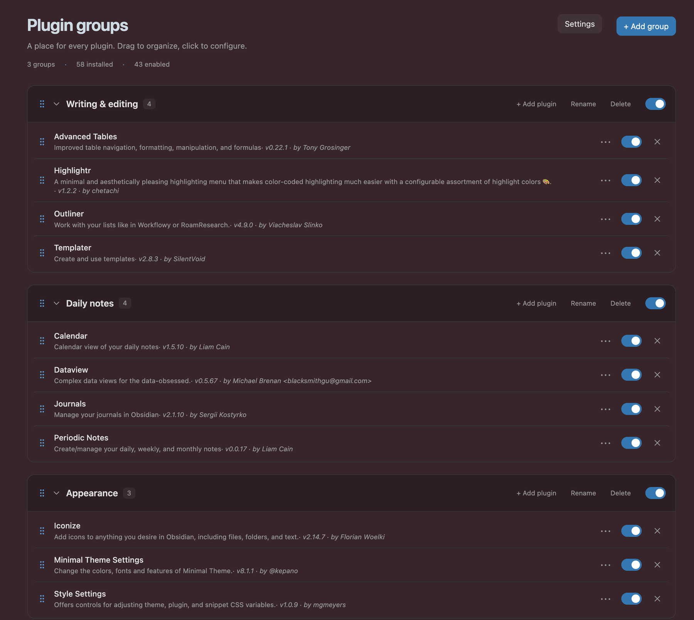

Plugin Groups Admin allows you to order plugins into groups and manage them.

## Using the tab

Open **Plugin groups** from the ribbon or command palette. Select **+ Add group** to create a group. Drag plugins from **Ungrouped** into a group, or use **+ Add plugin** in a group to choose one from a searchable list. You can rename, reorder, collapse, and delete groups.

To hide the ribbon button, turn off **Show ribbon button** in the plugin settings. The command palette entry remains available.

**Ungrouped** lists plugins that are not in a group. Its search field filters by plugin name or ID. Deleting a group does not uninstall its plugins; they return to **Ungrouped** unless they belong to another group.

## Plugin controls

- Use a plugin's switch to enable or disable it. A group's switch controls all installed plugins in that group.
- Click a plugin to open its settings. Plugins without a settings page open in **Community plugins**.
- Use a plugin's **⋯** menu for details and other available actions, such as hotkeys or uninstall.

Plugin Groups Admin stays enabled if you switch off a group that contains it.

## Allow multiple groups

By default, a plugin can belong to one group. The **Allow plugins in multiple groups** setting lets it appear in several groups. Group assignments are saved.
